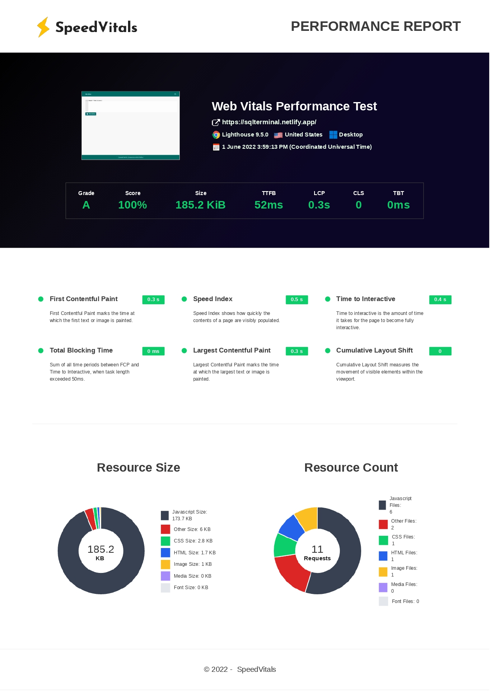

# 🚀 SQL Editor

This is a REACT SQL Editor built using ReactJs and TailwindCSS.

## 👨‍💻 Demo

Try out the website : [REACT SQL Editor](https://sqlterminal.netlify.app/)

## 👨‍🔧 Tech Stack

## 👨‍💻 Features

:white_check_mark: Users can get data of any of the predefined SQL queries either by using SQL Editor.\
:white_check_mark: Users can navigate to different pages using pagination.\

## ✍️ Predefined SQL Queries

- `select * from customers`
- `select * from categories`

## ⏱ Page Load Time

Page Load time of this website in desktop is in the range of 0.3 s to 0.5s.

I calculated the performance and load time of this website using SpeedVitals.

## 🪜 Steps I took to optimize the page load time

- Used code-splitting with `React.Lazy()` and `Suspense` to lazy load the components and split javaScript into multiple chunks using Dynamic runtime Imports for faster page load.
- Used `React.Memo()` to optimize the render performance of functional components.

